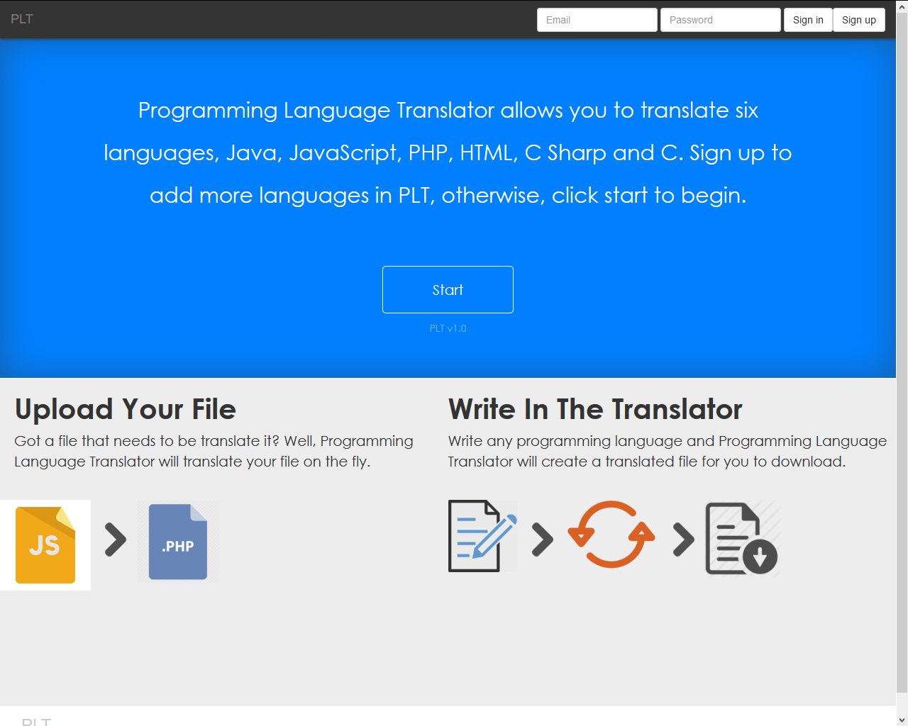

#Vang Lee Individual Project: PLT (Programming Language Translator)

###Problem Statement

Programming Language Translator website will be a great solution for programmers and developers who need to write a small source code from a different language can use it to translate to another language. This would decrease the time needed to learning another language. 

JSP homepage screenshot:

### Project Technologies/Techniques
* Security/Authentication
  * Admin role: read and delete of all data
  * User role: submit files to admin, submit feedback, message admin and use translator
  * Guest role: use translator and submit feedback
* Web Services or API's.
  * (Undecided) Google Closure Compiler Service API for compiling codes
  * (Undecided) Ideone API for compiling codes
* Database (MySQL and Hibernate)
  * Stores users, messages, trash and feedback
*  Bootstrap
* Logging
  * Logging for JUnit and API compilier
* Unit Testing
  * JUnit tests 80%
* Independent Research Topic
  * Bootstrap forms and menu.

* Other features:
  * Messaging between users and admin
  * automatic import APIs for specific languages 

### Design
* [Screen Design] (DesignDocuments/Screens.md)
* [Database] (DesignDocuments/database.md)
* Work flow will be added soon
